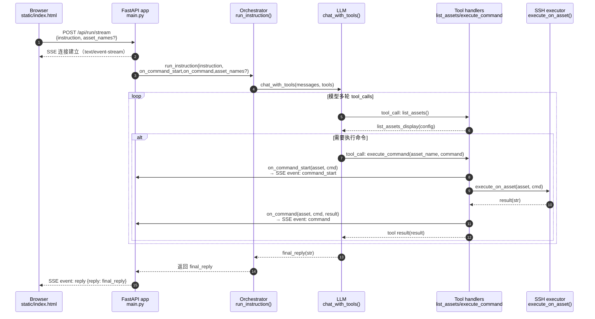

# Linux 智能运维助手

接入 **DeepSeek**，通过自然语言指令自动完成 Linux 资产运维：服务器巡检、自动部署、查看磁盘/内存/进程等。你只需输入指令，其余由 AI 规划并在目标机器上执行。

## 功能概览

- **自然语言指令**：如「对 web-server-01 做一次巡检」「检查所有服务器磁盘使用率」
- **DeepSeek 接入**：使用 OpenAI 兼容 API，规划步骤并决定执行哪些命令
- **Linux 执行**：通过 SSH 在配置的资产上执行命令，结果回传 AI 继续分析
- **资产管理**：在 `config.yaml` 中配置多台 Linux 服务器（密码或密钥认证）


## 快速开始

### 1. 安装依赖

```bash
cd D:\project\AI-assistant
pip install -r requirements.txt
```

### 2. 配置

复制示例配置并填写：

```bash
copy config.example.yaml config.yaml
```

编辑 `config.yaml`：

- **deepseek.api_key**：使用 DeepSeek 官方接口时必填，从 [DeepSeek 控制台](https://platform.deepseek.com/api_keys) 获取；也可设置环境变量 `DEEPSEEK_API_KEY` 而不写入文件。若使用本地 Ollama（OpenAI 兼容接口），可不填（程序会自动使用一个占位 key）
- **deepseek.base_url**：默认 `https://api.deepseek.com`。若使用本地 Ollama，填 `http://<Ollama_IP>:11434/v1`（例如 `http://192.168.1.205:11434/v1`）。如果你只填到 `http://<ip>:11434`，程序也会自动补上 `/v1`
- **deepseek.model**：DeepSeek 官方常用 `deepseek-chat`；Ollama 里填你本地模型名（例如 `deepseek-r1:8b`）
- **assets**：添加你的 Linux 服务器（host、username、password 或 private_key_path）
- **dingtalk.app_secret**：可选，钉钉应用机器人的 AppSecret，用于校验回调签名；**dingtalk.encoding_aes_key**：若钉钉开启了消息加密，填写加密密钥（43 位）以解密消息；**dingtalk.token** 与 **dingtalk.app_key**（或 **dingtalk.corp_id**）：开启加密后保存「消息接收地址」时钉钉会做 URL 校验，需在事件订阅中填写 Token，并填写 **app_key**（Client ID）或企业 CorpId

### 使用本地 Ollama（DeepSeek R1 8B）

1. 在部署 Ollama 的机器上监听局域网（否则只会监听 127.0.0.1）：

```bash
export OLLAMA_HOST=0.0.0.0:11434
ollama serve
```

2. 确认可用（与你的 curl 一样）：

```bash
curl http://192.168.1.205:11434/v1/chat/completions \
  -H "Content-Type: application/json" \
  -H "Authorization: Bearer ollama" \
  -d '{"model":"deepseek-r1:8b","messages":[{"role":"user","content":"hello"}]}'
```

3. `config.yaml` 配置示例：

```yaml
deepseek:
  api_key: "ollama"
  base_url: "http://192.168.1.205:11434/v1"
  model: "deepseek-r1:8b"
```

### 3. 运行

**方式一：Web 界面（FastAPI）**

```bash
pip install -r requirements.txt
uvicorn main:app --reload --host 0.0.0.0
```

浏览器访问 `http://localhost:8000`，在页面输入指令并点击「执行」即可。同一会话内可连续对话，历史会话会持久化到数据库。  
**资产管理**：访问 `http://localhost:8000/assets` 可增删改 Linux 资产；资产与会话均持久化在数据库中，并可上传文件到指定资产。

**数据存储**：会话与资产均保存在项目目录下的 `data/sessions.db`（SQLite）。首次启动时若数据库中无资产且存在 `config.yaml` 中的资产配置，会自动迁移到数据库。可通过环境变量 `AI_OPS_SESSION_DB` 指定路径，例如：`AI_OPS_SESSION_DB=/var/lib/ai-ops/sessions.db`。

- **API 文档**：`http://localhost:8000/docs`
- **提交指令**：`POST /api/run`，请求体 `{"instruction": "对 linux_222 做一次巡检"}`，返回 `{"reply": "...", "commands": [...]}`
- **记录交互到文件（排查中间过程）**：
  - 默认写入：`./logs/interaction/<trace_id>_<YYYYMMDD>_<HHMMSS>.txt`（如 `2375c81ca3e2_20260206_143052.txt`）
  - 如需自定义目录，设置环境变量 `AI_OPS_INTERACTION_LOG_DIR` 为目录路径（如 `./mylogs`），每次执行会在该目录下生成带时间戳的上述文件名，记录每轮 assistant/user 及最终回复，便于查看具体发生了哪些交互。
- **资产列表**：`GET /api/assets` 返回已配置资产（不含密码）
- **资产管理**：`POST /api/assets` 新增、`PUT /api/assets/{name}` 更新、`DELETE /api/assets/{name}` 删除
- **上传文件**：`POST /api/upload`（multipart：file、asset_name、remote_path 可选）将文件上传到指定资产
- **钉钉接入**：`POST /webhook/dingtalk` 钉钉应用机器人 HTTP 回调；在群里 @ 机器人或单聊发指令即可执行运维，结果通过 sessionWebhook 回发

### 钉钉接入（可选）

1. 登录 [钉钉开放平台](https://open.dingtalk.com)，创建企业内部应用，在应用里添加「机器人」。
2. 机器人设置中「接收消息」选择 **HTTP**，消息接收地址填：`https://你的服务器域名/webhook/dingtalk`（需公网可访问）。
3. 在应用详情中复制 **AppSecret**，填入 `config.yaml` 的 `dingtalk.app_secret`。
4. 若在钉钉应用/事件订阅中开启了**消息加密**，需在应用详情中复制 **加密密钥（EncodingAESKey，43 位）** 填入 `dingtalk.encoding_aes_key`；并填写 **Token** 到 `dingtalk.token`，以及 **app_key**（即 Client ID，如 dingxxx）到 `dingtalk.app_key`，否则保存消息接收地址时的 URL 校验会失败。未开启加密则可不填。
5. 在钉钉群里添加该机器人，或与机器人单聊；@ 机器人并发送运维指令（如「对 linux_222 做一次巡检」），机器人会先回复「正在执行，请稍候…」，执行完成后把结果发回群/单聊。

**方式二：命令行直接运行（无需安装包）**

```bash
python run.py "对 web-server-01 做一次巡检"
python run.py -i   # 交互模式，输入 exit 退出
```

**方式三：安装后以模块运行**

```bash
pip install -e .
python -m ai_ops_assistant.cli "对 web-server-01 做一次巡检"
ai-ops-assistant "对 web-server-01 做一次巡检"
```

**更多示例**

```bash
python run.py "对 linux_222 做一次巡检"
python run.py "列出所有服务器并检查磁盘使用率"
python run.py "在 db-server-01 上查看 top 前 10 进程和内存"
```

执行过程中，CLI 会打印每次在对应资产上执行的命令与结果，最后输出助手的总结。

## 项目结构

```
AI-assistant/
├── main.py                # FastAPI Web 入口
├── run.py                 # 命令行入口（无需安装包）
├── static/
│   └── index.html         # Web 前端页面
│   └── assets.html        # 资产管理页面
├── config.example.yaml    # 配置示例（勿提交密钥）
├── config.yaml            # 实际配置（本地填写，已 gitignore）
├── requirements.txt
├── pyproject.toml
├── README.md
└── src/
    └── ai_ops_assistant/
        ├── __init__.py
        ├── config.py         # 配置加载
        ├── llm.py            # DeepSeek API + 工具定义
        ├── ssh_executor.py   # SSH 执行与资产管理
        ├── orchestrator.py   # 指令 → AI → 执行 → 反馈 编排
        └── cli.py            # 命令行入口
```

## Web 页面到助手回复：代码流转（含 SSE 实时过程）

### 端到端调用链（Web → FastAPI → 编排 → LLM/SSH → SSE 回传）



### SSE 事件与后端回调对齐（1:1）

Web 前端（`static/index.html`）通过 SSE 监听这些事件类型，后端在 `main.py` 内将 `run_instruction()` 的回调直接映射为事件：

- **`command_start`** ↔ **`on_command_start(asset_name, command)`**：命令开始执行前立刻推送，用于前端先渲染“执行中…”
- **`command`** ↔ **`on_command(asset_name, command, result)`**：命令执行完成后推送，用于前端把 pending 块替换为真实输出
- **`reply`** ↔ `run_instruction()` 返回值：最终助手总结
- **`error`** ↔ 异常捕获：配置缺失/运行错误等

事件格式（每个事件块用空行分隔）：

```text
event: command_start
data: {"asset_name":"web-server-01","command":"df -h"}

event: command
data: {"asset_name":"web-server-01","command":"df -h","result":"..."}

event: reply
data: {"reply":"...最终总结..."}
```

## MCP 本地服务（可选）

本项目当前采用 **Orchestrator + 严格协议**（自研 Agent：模型只输出 JSON action，程序解析后执行），不依赖模型原生 function calling，适合 Ollama / vLLM / DeepSeek R1 等本地模型。

若你希望用 **MCP（Model Context Protocol）** 把「工具执行」标准化，便于 Cursor、Claude Code 等 MCP 客户端复用同一套运维能力，可单独启动本地 MCP Server：

- **作用**：用标准 MCP 协议暴露 `list_assets`、`execute_command` 两个工具，执行权仍在你的 `config.yaml` + SSH，与现有 Web/CLI 共用配置。
- **架构**：模型 → 你的 Orchestrator（解析输出）→ MCP Client → **本 MCP Server** → SSH。不是模型直接 call tool，而是「模型生成意图 → 你的代码决定是否调用 MCP」。

**运行 MCP Server**

```bash
pip install -r requirements-mcp.txt
AI_OPS_CONFIG=config.yaml python mcp_server.py
# 默认 HTTP：http://127.0.0.1:8002/mcp（端口 8002 避免与主站 8000 冲突）
# stdio：python mcp_server.py --transport stdio
```

**连接示例**

- **MCP Inspector**：`npx -y @modelcontextprotocol/inspector` → 连接 `http://localhost:8002/mcp`
- **Claude Code**：`claude mcp add --transport http ai-ops http://localhost:8002/mcp`

**通过 MCP 实现 func call（本地 DeepSeek 无原生 tool_calls 时）**

1. 先启动 **Tool HTTP 服务**（默认 8002，与主站 8000 不冲突）：
   ```bash
   AI_OPS_CONFIG=config.yaml python mcp_server.py --tool-http
   ```
2. 在 `config.yaml` 中开启：
   ```yaml
   deepseek:
     use_self_coded_fc: true
     use_mcp_for_tools: true
     mcp_tool_url: "http://127.0.0.1:8002/tool"
   ```
3. 流程：模型（DeepSeek/Ollama）输出 **JSON 或 \<tool_call\>** → 程序解析 → 通过 HTTP 调用 MCP Tool 服务执行 → 结果回传模型。执行权在你这边的 MCP Server，不依赖模型原生 function calling。

**与当前方案的关系**

| 方式 | 说明 |
|------|------|
| 现有 Web/CLI | 直接用 Orchestrator + 自研 JSON/\<tool_call\> 解析，执行可走本地或 MCP |
| use_mcp_for_tools: true | 解析仍在本项目，工具执行走 MCP Tool HTTP，实现「通过 MCP 做 func call」 |
| MCP Server（Inspector/Claude） | 同一套能力通过 MCP 协议暴露给 Cursor/Claude 等客户端 |

## 安全说明

- 不要将 `config.yaml` 或含 API Key / 密码的文件提交到版本库
- 建议使用 SSH 密钥而非密码；生产环境可将 API Key 放在环境变量，由程序从环境变量读取后写入配置或直接传参

## 扩展

- 可在 `llm.py` 中增加更多工具（如「上传文件」「执行脚本」），并在 `orchestrator.py` 中注册
- 可在 `config.yaml` 中增加更多资产，AI 会通过 `list_assets` 看到并选择目标机器
